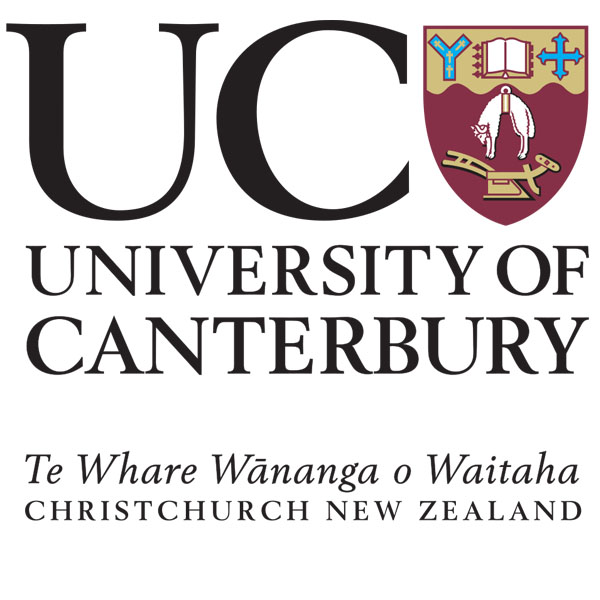
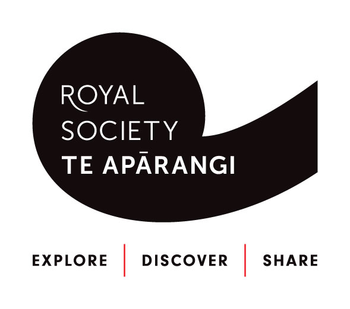
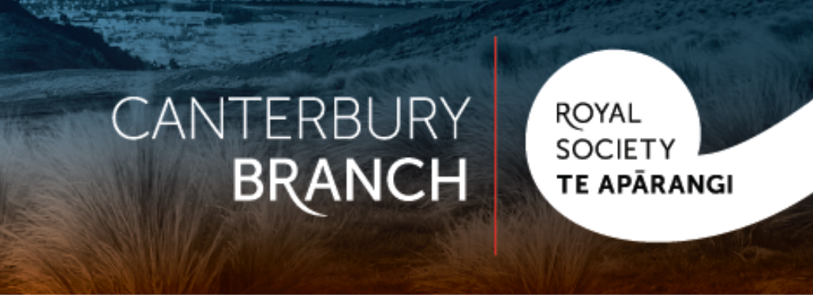

# Welcome

Hello! Welcome to the website for our computational imaging laboratory, thanks for visiting.
<br>
<br>
We work on imaging tiny objects using the computer as a lens. These tiny objects include:
* Proteins
* Viruses
* Nanoparticles
* Microscopic structures

Our ultimate goal of visualising these objects is to help cure diseases, engineer a more sustainable future, and increase our understanding of nature herself.

The methods we are currently working on to achieve this goal are


We mainly use Python
```python
print('hello world')
```


Check out our 
[research](research.md) page for more details.
[publications](publications.md)


# Funding 
Our work is supported by:
* UC Doctoral Scholarship
* R H T Bates Postgraduate Scholarship from the Royal Society of New Zealand Te Apārangi
* Travel Scholarship from the Canterbury Branch of the Royal Society of New Zealand Te Apārangi





<br>
<br>
<br>
