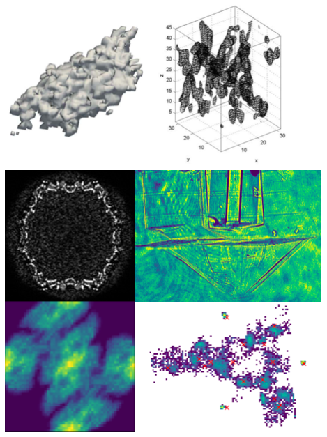

# Welcome

Hello! Welcome to the website for our computational imaging laboratory, thanks for visiting.
<br>
<br>
We work on imaging tiny objects using the computer as a lens. These tiny objects include:
* Proteins
* Viruses
* Nanoparticles
* Microscopic structures

We develop methods to visualise these objects and collaborate with biologists, chemists, engineers and physicists to achieve our ultimiate goal of helping to cure diseases, engineer a more sustainable future, and increase our understanding of nature herself.

A selection of the things we have been imaging is shown below
<p align="center">
  
</p>
they are (clockwise from the top left): a [Cathepsin B](https://en.wikipedia.org/wiki/Cathepsin_B) molecule; parts of an [aquaporin protein](https://pdb101.rcsb.org/motm/173); an optical image of a 3D printed nozzle used for X-ray free-electron laser experiments, an image of a [I3C molecule](https://doi.org/10.1107/S0907444908030266) showing a potential distribution of electrons after an X-ray pulse; a projection image of two [Photosystem I](https://pdb101.rcsb.org/motm/22) trimers packed in their unit cell; and the cross section of a [tobacco necrosis virus](https://www.rcsb.org/structure/1TNV).

Apart from the nozzle and the I3C molecule, the other images are all simulations which we have generated using the **[Software](software.md)** that we are developing. We use these simulations to test the algorithms we are developing. Hence, you can see that we focus on developing novel imaging methods to aid our fellow scientists and engineers from other fields. The methods we are currently working on are described in our **[Research](research.md)** page.

We mainly use Python for our work.
```python
print("hello world")
```
You can find a collection of computer programming and other educational resources in our **[Teaching](teaching.md)** page.


## Funding 
Our work is supported by:
* UC Doctoral Scholarship
* R H T Bates Postgraduate Scholarship from the Royal Society of New Zealand Te Apārangi
* Travel Scholarship from the Canterbury Branch of the Royal Society of New Zealand Te Apārangi

<p align="center">

</p>

