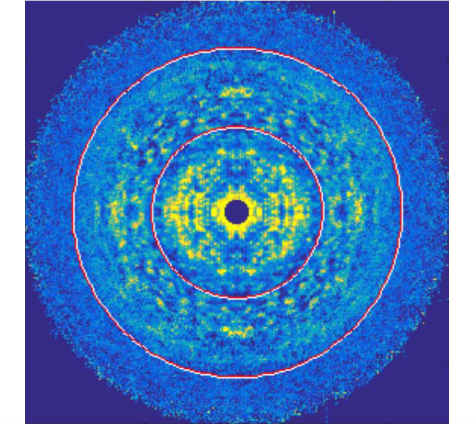
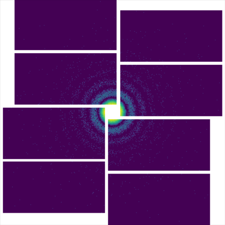

# Research

We develop new algorithms and computational methods to process and analyse X-ray diffraction data. The goal is to extract meaningful information from the data to improve our understanding of the structures of biological molecules such as proteins and viruses.

---

## Imaging with small crystals

Crystals are packings of objects in a regular array. Among many other advantages, they are useful for increasing the diffraction signal from small objects. However the use of large crystals result in signals being concentrated in a way such that there is insufficient information to reconstruct the structure of the packed molecules.

The recent development of a new type of X-ray source called the X-ray free-electron laser (XFEL) provides X-rays with unprecedented brightness, coherence and short duration pulses. These unique properties of XFELs have allowed very small crystals, only a few repeating units across, to be used, resulting in new, measurable, signals from the coherent illumination of the entire crystal. The extra signals enable the possibility of solving for the structure of the molecules directly from the diffracted intensity itself.

We have developed algorithms that is able to do this in principle and are working on applying the algorithms to experimental data.

**Background Reading**
1. Elser, "Direct phasing of nanocrystal diffraction", _Acta Cryst. A_, **69**, 559–569 (2013).
2. Chen, Spence and Millane, "Direct phasing in femtosecond nanocrystallography I. Diffraction characteristics", _Acta Cryst. A_, **70**, 143–153 (2014).
3. Kirian, Bean, Beyerlein, et al., "Direct Phasing of Finite Crystals Illuminated with a Free-Electron Laser", _Phys. Rev. X_, **5**, 011015 (2015).
4. Chen, Donatelli, Schmidt and Kirian. "Shape transform phasing of edgy nanocrystals", _Acta Cryst. A_, **75**, 239–259 (2019).

---

## Imaging with disordered crystals

Crystals are regularly packed arrays of objects - usually. Sometimes there are deviations of the packings from an ideal lattice. These include things such as: 
 
&nbsp;&nbsp;&nbsp;&nbsp;  1. Translational disorder (displacements around lattice points)
 
&nbsp;&nbsp;&nbsp;&nbsp;  2. Substitutional disorder (different units making up the crystal)
 
&nbsp;&nbsp;&nbsp;&nbsp;  3. Stacking faults (a discontinuous change in the packing)

When there are deviations of the packing from an ideal lattice, useful diffraction signals can arise. We are interested in developing algorithms to utilise these extra signals resulting from crystal defects to reconstruct the molecule that packs the crystal and recover statistical information about these defects. It turns out that the algorithm developed for imaging with small crystals can be adapted to imaging with certain kinds of disordered crystals.

Image above was part of N. Stander's thesis 2019.

**Background Reading**
1. Ayyer, Yefanov Oberthür, _et al._, "Macromolecular Imaging with Imperfect Crystals", _Nature_, **530**, 202 (2016).
2. Morgan, Ayyer, Barty, _et al._, "Ab initio phasing of the diffraction of crystals with translational disorder ", _Acta Cryst. A_, **75**, 25–40 (2019).
3. Stander, "Serial femtosecond crystallography data analysis of Photosystem II", PhD Thesis, ASU (2019).
4. Chen, Donatelli, Schmidt and Kirian. "Shape transform phasing of edgy nanocrystals", _Acta Cryst. A_, **75**, 239–259 (2019).

---

## Single particle imaging
 

Imaging individual proteins in their native, uncrystallised state at physiological conditions is also possible with the increased X-ray brightness provided by XFELs. However, even under optimal conditions, current XFELs can only provide a few photons per diffraction pattern from single proteins. Some of the other pressing issues include slight differences between individual proteins, unknown particle orientations, variable incident X-ray intensity and detector artefacts.
We would like to investigate and develop algorithms that are able to solve some, or even all, of these problems.

We are also interested in combining single particle X-ray data with data from other imaging modalities such as electron and optics to try and build synergistic techniques for an integrative, multi-modal imaging framework.

**Background Reading**
1. Loh and Elser, "Reconstruction algorithm for single-particle diffraction imaging experiments", _Phys. Rev. E_, **80**, 026705 (2009).
2. Ekeberg, Svenda, Abergel _et al._, "Three-Dimensional Reconstruction of the Giant Mimivirus Particle with an X-Ray Free-Electron Laser", _Phys. Rev. Lett._, **114**, 098102 (2015).
3. Donatelli, Sethian and Zwart, "Reconstruction from limited single-particle diffraction data via simultaneous determination of state, orientation, intensity, and phase", _PNAS_, **114**, 7222–7227 (2017).
4. Ayyer, "Reference-enhanced x-ray single-particle imaging", _Optica_ **7**, 593–601 (2020).

---

## Constraint satisfaction algorithms

One of the main algorithms we use are called "iterative projection algorithms." These are dynamical systems that are able to find solutions to problems that can be formulated as multiple constraints. Phase retrieval is an example of a constraint satisfaction problem where the constraint in Fourier space is the measured Fourier magnitudes and the constraint in real-space are information about the object such as the fact that it is finite. We design algorithms, with mathematics on paper and writing programs in the computer, to solve variations on the basic phase retrieval problem. We are also interested in other related challenges such as packing problems, numerical optimisation and search algorithms, all of which can be formulated as constraint satisfaction problems.

**Background Reading**
1. Marchesini. "A unified evaluation of iterative projection algorithms for phase retrieval" _Review of Scientific Instruments_ **78**, 011301 (2007).
2. Elser, Rankenburg, and Thibault. "Searching with iterated maps". _PNAS_, **104**, 418-423 (2007).
3. Millane and Lo. "Iterative projectionalgorithms in protein crystallography. I.Theory"  _Acta Cryst. A_, **69**, 517-527 (2013).
4. Chen, Arnal, Morgan _et al_. "Reconstruction of an object from diffraction intensities averaged over multiple object clusters" _Journal of Optics_, **18**, 114003 (2016).
