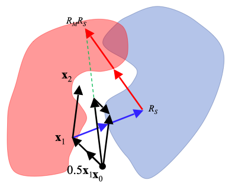

# Research

We develop new algorithms and computational methods to process and analyse X-ray diffraction data collected at an X-ray free-electron laser. The goal is to extract meaningful information from the data to elucidate the structure of biological molecules such as proteins and viruses.

## Shape-transform phasing

## Phasing from crystal defects
Intensities between Bragg peaks can also arise from the deviation of a crystal's unit packing from their ideal lattice sites.

## Single particle imaging

We are also interested in combining single particle X-ray data with data from other modalities such as electron and optics to investigate techniques for multi-modal imaging.

## Constraint satisfaction algorithms

One of the main algorithms we use are called "iterative projection algorithms." These are dynamical systems that are able to find solutions to problems that can be formulated as multiple constraints. Phase retrieval is an example of a constraint satisfaction problem where the constraint in Fourier space is the measured Fourier magnitudes and the constraint in real-space are information about the object such as the fact that it is finite. We design algorithms, on paper and in the computer, to solve variations on the basic phase retrieval problem. We are also interested in other related challenges such as packing problems, and other constraint satisfaction problems.

**Background reading**
 
[1] Marchesini. "Invited Article: A unified evaluation of iterative projection algorithms for phase retrieval" _Review of Scientific Instruments_ **78**, 011301 (2007).
 
[2] Elser, Rankenburg, and Thibault. "Searching with iterated maps". _PNAS_, **104**, 418-423 (2007).
 
[3] Millane and Lo. "Iterative projectionalgorithms in protein crystallography. I.Theory"  _Acta Cryst. A_, **69**, 517-527 (2013).
 
[4] Chen, Arnal, Morgan _et al_. "Reconstruction of an object from diffraction intensities averaged over multiple object clusters" _Journal of Optics_, **18**, 114003 (2016).
