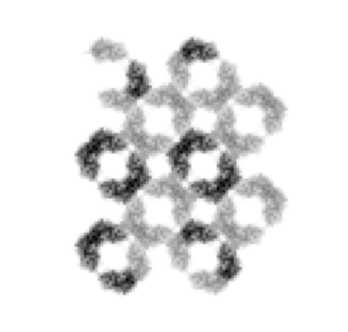

# Research

We develop new algorithms and computational methods to process and analyse X-ray diffraction data. The goal is to extract meaningful information from the data to improve our understanding of the structures of biological molecules such as proteins and viruses.

## Shape-transform phasing

The recent development of a new type of X-ray source called the X-ray free-electron laser (XFEL) provides X-rays with unprecedented brightness, coherence and short duration pulses. These unique properties of XFELs have allowed very small crystals to be used, resulting in new measurable signals from the coherent illumination of the entire crystal. The extra signals enable the possibility of determining the structure of the molecules directly from the diffracted intensities.

**Background Reading**
 
[1] Chen, Spence and Millane. Acta Cryst. A, 70, 143–153 (2014).
 
[2] Kirian, Bean, Beyerlein, et al., Phys. Rev. X, 5, 011015 (2015).
 
[3] Elser, Acta Cryst. A, 69, 559–569 (2013).
 
[4] Chen, Donatelli, Schmidt and Kirian. Acta Cryst. A, 75, 239–259 (2019).

---

## Phasing from crystal defects

Useful diffraction signals can also arise due to deviations from an ideal crystal lattice. These deviations include things such as translational disoder, substitutional disorder, and stacking faults. We are interested in developing algorithms that utilise these defects to reconstruct the molecule and recover statistical information about those defects.

**Background Reading**
 
[1] Ayyer, Yefanov Oberthür, et al. "Macromolecular Imaging with Imperfect Crystals", Nature 530 (7589), 202 (2016).
 
[2] Morgan, Ayyer, Barty, et al., Acta Cryst. A, 75, 25–40 (2019).
 
[3] Chen, Donatelli, Schmidt and Kirian. Acta Cryst. A, 75, 239–259 (2019).

---

## Single particle imaging

Imaging individual proteins in their native, solvated, uncrystallised state at physiological conditions is also possible with the increased X-ray brightness provided by XFELs. However, even under optimal conditions, current XFELs can only provide a few photons per diffraction pattern from single proteins. Other issues include slight differences between individual proteins, unknown orientations, variable incident X-ray intensity, detector artefacts.
We would like to investigate and develop algorithms that are able to solve some, or even all, of these problems.

We are also interested in combining single particle X-ray data with data from other imaging modalities such as electron and optics to try and build synergistic techniques for an integrative, multi-modal imaging framework.

---

**Background Reading**
 
[1] Loh and Elser, Phys. Rev. E, 80, 026705 (2009).
 
[2] Ekeberg, Svenda, Abergel et al., Phys. Rev. Lett., 114, 098102 (2015).
 
[3] Donatelli, Sethian and Zwart, PNAS, 114, 7222–7227 (2017).
 
[4] Ayyer, Optica 7, 593–601 (2020).

---

## Constraint satisfaction algorithms

One of the main algorithms we use are called "iterative projection algorithms." These are dynamical systems that are able to find solutions to problems that can be formulated as multiple constraints. Phase retrieval is an example of a constraint satisfaction problem where the constraint in Fourier space is the measured Fourier magnitudes and the constraint in real-space are information about the object such as the fact that it is finite. We design algorithms, on paper and in the computer, to solve variations on the basic phase retrieval problem. We are also interested in other related challenges such as packing problems, and other constraint satisfaction problems.

**Background Reading**
1. Marchesini. "A unified evaluation of iterative projection algorithms for phase retrieval" _Review of Scientific Instruments_ **78**, 011301 (2007).
2. Elser, Rankenburg, and Thibault. "Searching with iterated maps". _PNAS_, **104**, 418-423 (2007).
3. Millane and Lo. "Iterative projectionalgorithms in protein crystallography. I.Theory"  _Acta Cryst. A_, **69**, 517-527 (2013).
4. Chen, Arnal, Morgan _et al_. "Reconstruction of an object from diffraction intensities averaged over multiple object clusters" _Journal of Optics_, **18**, 114003 (2016).
