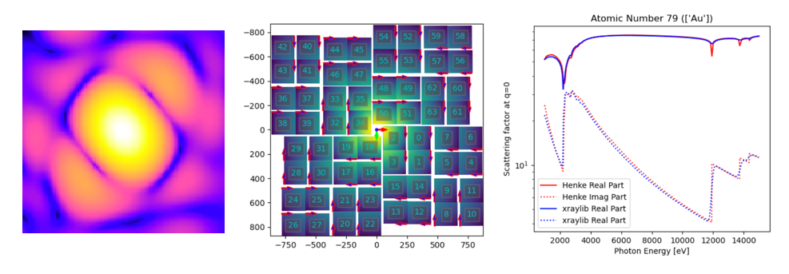

# Software
Here you'll find links to software that we develope, or contribute to developing, for our projects.

---
## Reborn
[reborn](https://kirianlab.gitlab.io/reborn/index.html) is a Python package containing utilities for simulating and analysing X-ray diffraction under the Born approximation. The reborn package also contains fast signal processing routines for tasks such as peak detection and signal-to-noise calculation. These routines are implemented using Fortran and interfaced with Python via the f2py module from numpy.

The documentation for reborn also contains [useful notes](https://kirianlab.gitlab.io/reborn/crystals.html) on the mathematics and the theory associated with X-ray diffraction.

To get started with reborn follow the installation instructions [here](https://kirianlab.gitlab.io/reborn/installation.html) and once you've obtained the package, you can simply import it as usual by

```Python
import reborn
```

 

---

## Reconstruction from projection images affected by Ewald curvature

We published a paper in 2021 detailing an algorithm that is able to reconstruct a 3-dimensional object from 2-dimensional projection images affected by the Ewald sphere [1]. Such an algorithm is useful in cryo-electron microscopy when larger samples, higher resolution, or lower energy electron beams are desired, all of which contribute to the significance of the Ewald curvature.

The program developed for this research is freely available [here](https://gitlab.com/jpchen1/em-reconstruction-with-ewald/) and reproduces all of the figures and results in the paper.

1. Chen, Schmidt, Spence & Kirian. “A new solution to the curved Ewald sphere problem for 3D image reconstruction in electron microscopy” _Ultramicroscopy_, **224**, 113234 (2021).

