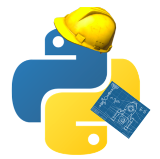

# Teaching

I enjoy teaching, and I am passionate about science education. I believe most of the world's problems can be solved through educating our next generations and inspiring them to discover a better future.
My expertise and interest is in physics and programming and some of the resources I have created can be found in this section.

---

## Jupyter Notebooks
Some illustratively inventive ipython notebooks created by me are maintained here.
These notebooks were initiated when I was organising the [Prickly Python](http://prickly-pythons.github.io/) meetings at Arizona State University where anyone interested can come along and learn about physics and Python.

### Python basics
* [If, else, for](https://htmlpreview.github.io/?https://github.com/captvonsciencypants/teaching/blob/main/if%2C%20else%2C%20for.html)

### Data processing

### Numerical methods
* [Solving differential equations](https://github.com/captvonsciencypants/teaching/blob/main/Differential%20Equations.ipynb)
* [Integration](https://github.com/captvonsciencypants/teaching/blob/main/Integration.ipynb)
* [Monte Carlo methods I](https://github.com/captvonsciencypants/teaching/blob/main/Monte%20Carlo%20I.ipynb)

### Physics

---

## COSC131 - Introduction to Programming for Engineers
 

COSC131 is a course that was started at the University of Canterbury (UC) in 2021 to teach Python to all first year engineering students. It was one of the largest course at UC with an enrolment number of approximately 1300 students. COSC131 is taught almost entirely with pre-recorded videos and online quizzes. I recorded a series of lecture videos on numerical methods and algorithms, consitituting the learning materials for week 10 of the course.

A sample is shown below.

The full series can be found here.

---

## Extra teaching and training resources on the web
There are some great resources available out there, waiting for people to discover.
I've collected of some of the best resources I've encountered over the years below in case others may find it useful too.

### Physics
1. David Tong at the University of Cambridge maintains [a set of wonderful introductory notes](http://www.damtp.cam.ac.uk/user/tong/teaching.html) covering every topic in theoretical physics from classical mechanics to quantum field theory.
2. The [New Zealand Young Physicist tournament](https://iypt.org.nz/) is a competition for high school students where teams of 3 to many students work together to investigate a set of simple but interesting everyday physics problems. The problems are a great resources to learn from. 

### Programming
1. ["Best Practices for Scientific Computing"](https://doi.org/10.1371/journal.pbio.1001745) by Wilson _et al._ - A nice article outlining many useful tips and strategies for writing good computer codes.
2. [https://www.nesi.org.nz/services/training](https://www.nesi.org.nz/services/training) - The New Zealand eScience Infrastructure designs, builds, and operates a specialised platform of shared high performance computing infrastructure in New Zealand. They often hold training courses and software carpentries for researchers at all levels of their career.

